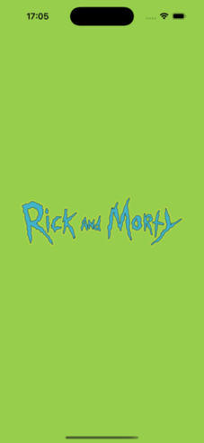

#  Rick & Morty iOS app
[](#)
[](#)


This application is an educational project developed to enhance my skills as an iOS mobile developer. This project focuses on improving my knowledge of API integration and UI design patterns in iOS development.

## Description

The app uses SwiftUI to create an engaging and interactive experience that allows users to explore characters from the Rick & Morty universe.

## Content

- MVVM pattern.
- Clean Architecture folder structure.
- Swift data.
- Rick & Morty API.

## Architecture

```
RickAndMorty_iOS
├── .gitignore
├── README.md
├── RickAndMorty
│   ├── Assets.xcassets
│   │   ├── AccentColor.colorset
│   │   │   └── Contents.json
│   │   ├── AppIcon.appiconset
│   │   │   ├── Contents.json
│   │   │   ├── rick_morty_icon_1024.png
│   │   │   ├── rick_morty_icon_152.png
│   │   │   └── rick_morty_icon_167.png
│   │   ├── Contents.json
│   │   ├── GreenR&M.colorset
│   │   │   └── Contents.json
│   │   └── Launch.imageset
│   │       ├── Contents.json
│   │       └── Rick_and_Morty_320.png
│   ├── ContentView.swift
│   ├── Data
│   │   ├── LocalDataSource
│   │   │   ├── LocalCharacterDataSourceImp.swift
│   │   │   └── LocalCharacterDataSourceProtocols.swift
│   │   └── NetworkDataSource
│   │       ├── NetworkCharacterDataSourceImpl.swift
│   │       └── NetworkCharacterDataSourceProtocols.swift
│   ├── Domain
│   │   ├── Model
│   │   │   ├── Character.swift
│   │   │   ├── CharactersList.swift
│   │   │   └── FavCharacterId.swift
│   │   ├── Repository
│   │   │   ├── CharacterRepositoryImpl.swift
│   │   │   └── CharacterRepositoryProtocols.swift
│   │   └── UseCases
│   │       ├── GetAllCharactersFromAPIUseCase.swift
│   │       ├── GetAllFavCharactersIdFromLocalDatabaseUseCase.swift
│   │       ├── InsertFavCharacterIdIntoLocalDatabaseUseCase.swift
│   │       └── RemoveFavCharacterFromLocalDatabaseUseCase.swift
│   ├── FavAppDemoApp.swift
│   ├── Info.plist
│   ├── Presentation
│   │   ├── Components
│   │   │   ├── CharacterCard
│   │   │   │   └── CharacterCard.swift
│   │   │   └── LikeButton
│   │   │       └── FavouriteButton.swift
│   │   ├── CharactersListView
│   │   │   ├── View
│   │   │   │   ├── CharactersListView.swift
│   │   │   │   └── FavCharactersListView.swift
│   │   │   └── ViewModel
│   │   │       └── CharactersListViewModel.swift
│   │   └── Pages
│   │       └── HomePage.swift
│   └── Preview Content
│       └── Preview Assets.xcassets
│           └── Contents.json
├── RickAndMorty.xcodeproj
│   ├── project.pbxproj
│   ├── project.xcworkspace
│   │   ├── contents.xcworkspacedata
│   │   └── xcuserdata
│   │       └── willy.xcuserdatad
│   │           └── UserInterfaceState.xcuserstate
│   └── xcuserdata
│       └── willy.xcuserdatad
│           └── xcschemes
│               └── xcschememanagement.plist
└── images
    ├── fav_tab_view_empty.png
    ├── fav_tab_view_list.png
    ├── launch_screen.png
    ├── list_tab_view.png
    └── list_tab_view_stars.png
```
## Screenshots

<div>
    
    
    
</div>

<div>
    
    
</div>
